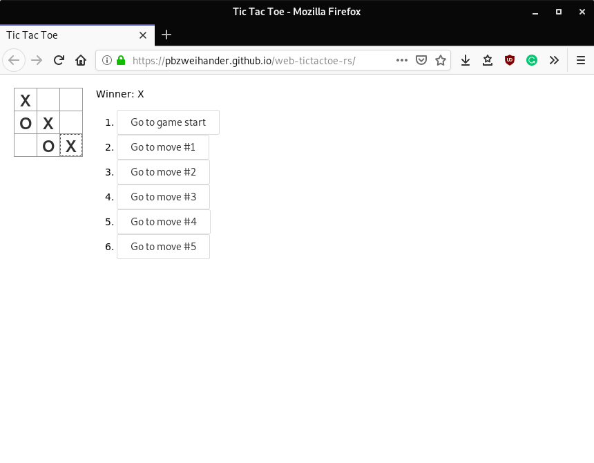

# Web TicTacToe

[Play](https://pbzweihander.github.io/web-tictactoe-rs/)

TicTacToe game from [React.js Tutorial](https://reactjs.org/tutorial/tutorial.html), written in Rust with [yew](https://github.com/DenisKolodin/yew)!

This is a demonstrational and experimental project showing that we can make web app with Rust.
